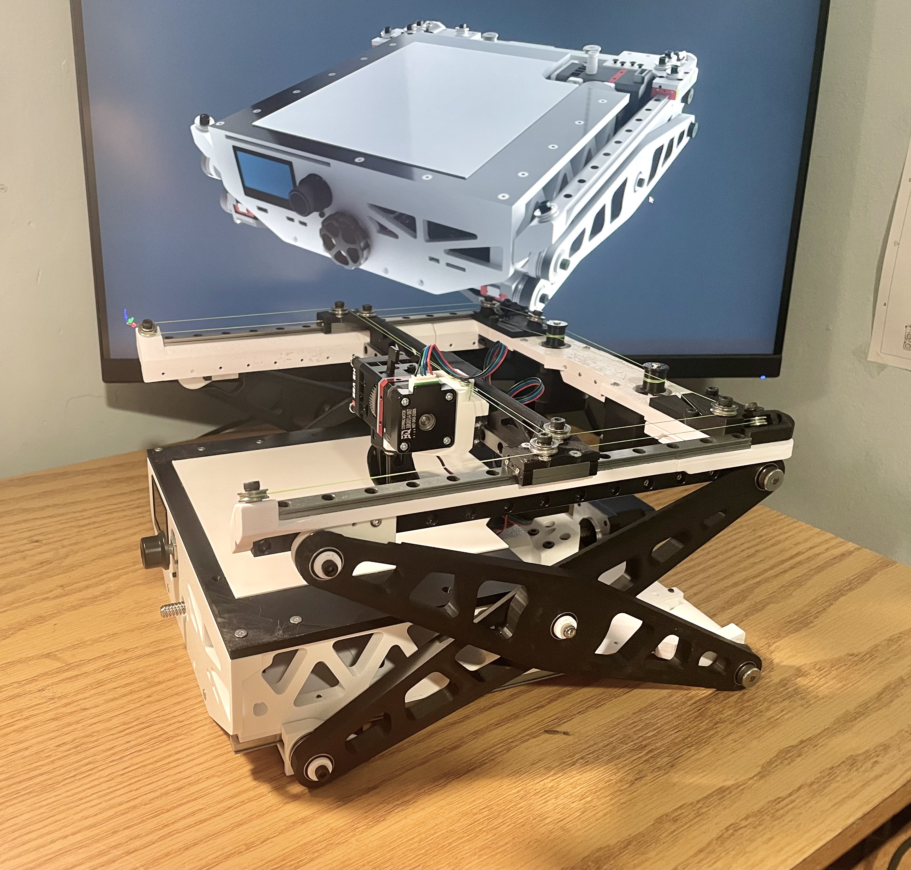
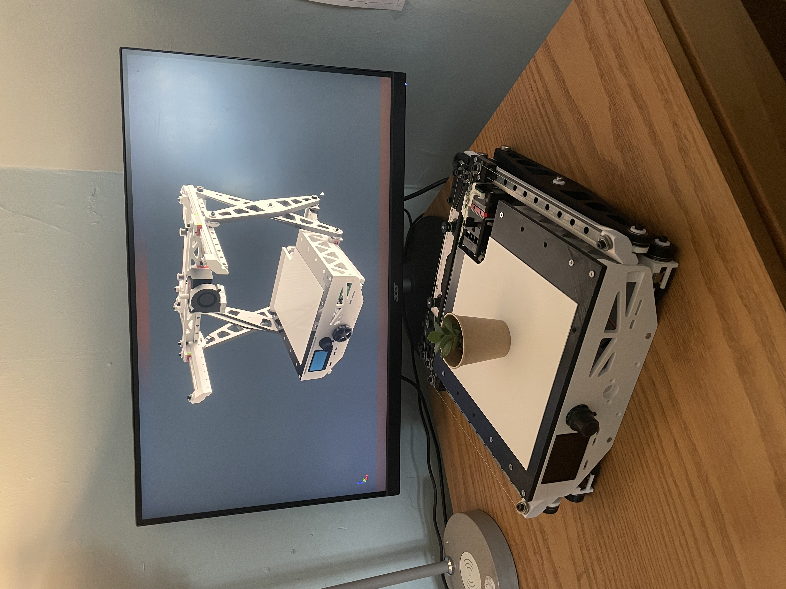
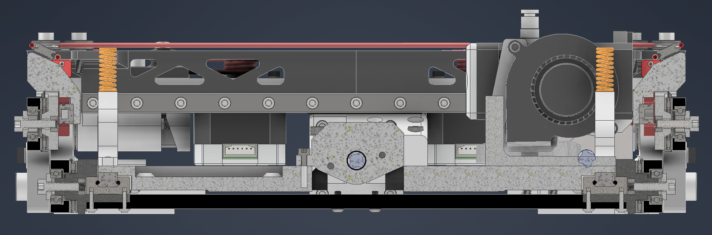

# Portable 3D Printer

**Engineering plastics capable, enclosed, direct drive, folding portable 3D printer that fits in a bag**

This printer collapses to a thin slab roughly the size of a laptop bag, then expands on a scissor-lift Z axis into a useful print volume. It is built almost entirely from 3D-printed parts on consumer machines, takes power from the same M18/DeWalt-class packs, and runs an enclosed heated chamber for ABS, ASA, and nylon. 

> **Status:** the v1 prototype is built and prints. v2, the version this repo is moving toward, is in active development. 

Desktop printers waste their whole volume when idle: the frame has to stay as tall as the full Z travel even when nothing is printing. This design stores that Z travel mechanically with a scissor lift, so the machine folds down to about **300 × 300 × 80 mm** and opens up to a **~180 × 200 × 175 mm** build volume. Nothing on the market targets *actual* portability, most "compact" printers are still stationary.

The trade-off is that scissor lifts amplify backlash and load at low angles, so pivot quality, preload, bearing choice, and arm stiffness all matter. The build uses two preloaded pivots per side, thrust/axial bearings clamped with bolts, ~50 × 6 mm shoulder bolts at the stationary bottom pivot pair, and compliant printed clamps to hold everything tight.

(images/BatteryPrinterExpanded.png)
(images/BatteryPrinterStowed.png)

## Inside the machine

The control stack runs a BTT SKR Mini E3 V3 with a Raspberry Pi 4 for higher-level control, on a 24 V bus, under Klipper. Klipper matters here specifically because a scissor lift has a **nonlinear** relationship between motor motion and nozzle height — software compensation maps motor position to true Z, which a conventional vertical gantry never needs.

---

## Roadmap

v2 is a significant rework. The single central lead screw in v1 dictated the entire superstructure — the bottom bridge plate had to tie the two sides together, which forced the surrounding frames. **Removing the central screw in favor of two independent side lead screws collapses that dependency chain and opens a large central cavity** big enough to carry a full 1 kg spool inside the machine. Shortening the rear pivot bolts opens further space.

The other v2 changes follow from a deliberate repositioning. v1 was built around "battery + low power, *therefore* no heated bed." v2 drops the onboard battery entirely (it's a liability, and true off-grid printing is rare in practice), adds a **heated bed** and a **folding bellows enclosure** for a warm chamber, and takes power from a **power-tool battery** mounted on the front.

Remaining v2 work:

- Dual side lead screws with software Z-tilt leveling
- Folding bellows enclosure targeting a 50–60 °C chamber
- Heated bed sized for the chamber and power budget
- Power-tool battery mounting blocks (front), replacing the screen
- Custom 90° hotend with rear cable routing (kills the floppy top conduit)
- 3 mm GT2 belt drive — HBot first, falling back to CoreXY if racking forces are too high

## Bill of materials

*Coming soon.* Core components: MGN9 linear rails (×3), NEMA 17 motors, T8 lead screws, U-groove pulleys / GT2 belt, thrust + deep-groove bearings, shoulder bolts for pivots, BTT SKR Mini E3 V3, Raspberry Pi 4.

## Build instructions

*Coming soon.* The structure is designed to print on Ender 3–class machines with no machined parts. CAD and design files are in the [`Scissor 3D Printer`](Scissor%203D%20Printer) folder.

## Firmware

Klipper, with nonlinear Z mapping for the scissor geometry. Configuration and flashing notes will live in a `/firmware` folder.

## License

- **Firmware and software:** [GNU GPLv3](LICENSE) — modify and redistribute freely; derivatives must stay open and credit the original.
- **Hardware design files** (CAD, STEP, drawings): [CERN-OHL-S v2](LICENSE-hardware) — same share-alike philosophy, written for hardware.

- Build videos and project updates: [gao.lab](https://www.instagram.com/@gao.lab)

